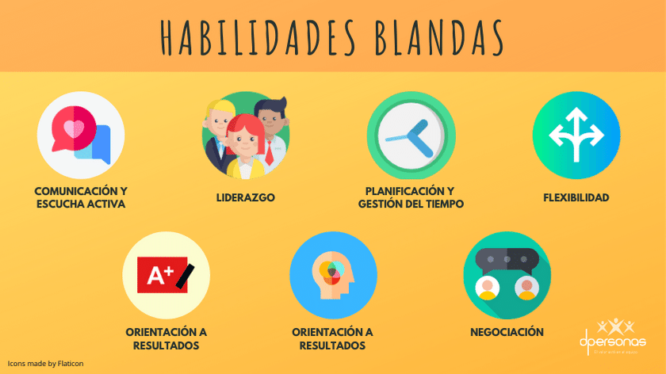

# Habilidades Blandas

## ¿Qué son las habilidades blandas?

Las habilidades blandas (o soft skills) son rasgos de carácter y competencias interpersonales que caracterizan la forma de interactuar y relacionarse de una persona con otras. Es decir, están más vinculadas con el comportamiento y la forma de ser de un individuo que con sus conocimientos o lo que sabe.

Su objetivo es desarrollar la personalidad, funcionando como herramientas que permiten mejorar las habilidades comunicativas, el trabajo en equipo, la toma de liderazgo y gestión del tiempo, entre otras. Estas competencias blandas incluyen desde cómo se habla a los demás, hasta cómo se piensa en soluciones para resolver problemas.

## Tipos de habilidades blandas
Las habilidades blandas pueden ser atributos personales, características de la personalidad y habilidades comunicativas necesarias para tener éxito en el trabajo. Asimismo, determinan cómo una persona interactúa con los demás.

#### Algunos tipos de habilidades blandas incluyen:

* adaptabilidad
* comunicación
* pensamiento creativo
* fiabilidad
* ética de trabajo
* trabajo en equipo
* positivismo
* gestión del tiempo
* motivación
* resolución de problemas
* pensamiento crítico
* resolución de conflictos

## Habilidades que considero que debe poseer y/o desarrollar un Ing. en Sistemas Computacionales 👩🏻‍💻💻

* Comunicación efectiva: La capacidad de explicar conceptos técnicos a personas no técnicas y colaborar con colegas y clientes.

* Trabajo en equipo: La habilidad para colaborar de manera efectiva con otros.

* Resolución de problemas: (Aunque es una habilidad técnica) Capacidad para abordar problemas complejos y encontrar soluciones innovadoras.

* Pensamiento crítico: Evaluar problemas y soluciones de manera lógica y objetiva para tomar decisiones informadas.

* Habilidades de presentación: Ser capaz de presentar ideas y resultados de manera clara y persuasiva a diferentes audiencias.

* Empatía: Entender y considerar las necesidades y perspectivas de los usuarios y compañeros para diseñar soluciones más efectivas.

* Inteligencia emocional: La capacidad de reconocer y gestionar tus propias emociones, así como las de los demás, es fundamental para trabajar en equipo y resolver conflictos.

* Resiliencia: La capacidad de enfrentar desafíos y recuperarse de los fracasos es esencial para mantener la motivación y seguir adelante.